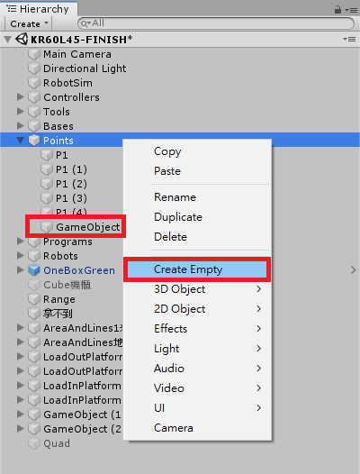

## RobotSim Simulate

- The instructions for the basic operation,  please refer [RobotSim Basic operations](https://yazelin.github.io/usc2019-RobotSim/zh-tw/1RobotSimBasic.html)

---

### Select a robot

- Robotic Type : KUKA KR60-L45-3 [Robotunitypackage](https://github.com/YangPeiYuan/RobotSim_Simulate/raw/master/object/KR60_L45.unitypackage)
	- Payload : 45kg
	- Max. reach: 2230cm
	
- Gripper : RGN+300-1[Gripper Model](https://github.com/YangPeiYuan/RobotSim_Simulate/raw/master/object/RGN300.FBX)

---

### Build working objects

1. Import KUKA KR60-L45-3、Gripper RGN+300-1
	- Import RobotSim custom package                         
                    
		 
		 
	- Add a Robot                                                                              
		

	- Add a gripper                                                                                
		
		
		
		- Find the gripper RNG300 on the menu of SampleScene
		- Drag the gripper RGN300 into the scene and set (Position) as  (X 0, Y 0, Z 0)

		
		- Rotate Robot w.r.t Y-axis(in Unity) at the center of the robot base with 180 degree such that the robot flange will face the gripper exactly.

		
		- Drag obiect RNG300 into Tool1 and set the Flange position at (0, -0.35, 0) such that the center of the flange will match to the center of the gripper RGN300 perfectly.

2. Drawing the working envelope of the robot 
	-To move the robot to observe the reach limitations          

	- Build a 3D spherical object                                                                      
		
		
	- set the scale                                                                         
		
		- set meter as the unit
		- For example: the max reach of the robot is 2.23m, we need to set 4.46m as its diameter. 
         
         
	- set the color                                                                   
		
		- Choose **Materials** and drag to **Element**                                     

	- Likewise, we can build the inner limitation of the robot
		

3. Build the working space

	- Drawing the wall or user's defined robot boundary
	- PS. 可用來觀察手臂運動中有無超越或撞機風險        
    
		
	
		
		- 將Cube改名為Line並設定線的長寬高、位置等等...
		- 第二條線只需要複製並調整位置即可
		- 位置參數為物件的中心，如要調整參數須注意
                                                                                                                     
		
		- 設定完成後場景

4. 建立其他專案所需物件

	- 適各專案模擬所需使用其他物件  
	- [箱子模型](https://github.com/YangPeiYuan/RobotSim_Simulate/raw/master/object/box.FBX)	長42CM 寬29CM 高15CM 

	 - 擺放物件方式                                       

		
		 - 利用位置 (Position) 參數放置物體實際位置，單位均為公尺(m)
                                                                                                                          
		
		- 如需要堆疊多個箱子，只需要先設定好第一個箱子位置，其餘則使用複製並更改其位置參數Y，向上移動盒子高度15CM
                                                                                                                      
		
		- 選擇物件，右上角取消勾選即能將物件取消不使用，但還是能保有物件設定，需要使用時再勾選即可
                                                                                                                            
		
		- 本專案經模擬後，手臂擺放位置更改成旋轉(Rotation)Y 150，此角度下手臂的工作路徑相對較順暢

--- 
### 點位記錄及模擬實作

1. 紀錄手臂點位

	- 使用位置參數設定點位 

		
		- 將手臂移動至物件夾取位置
		- 使用 [+Point] 功能紀錄點位

		
	
		-  記錄完第一點後，其他點只需要使用複製方式，並更改其位置參數(物件box高為15cm，每層點位位置Y相差0.15m)

	- 利用空物件進行分類幫助分類不同點位
                                                                                       
		
		- 創立一個空的物件GameObject
		                                                                               
		
		- 將物件名稱更改為所分類名稱BlueBox
		- 將點位P1至P1(4)拖移至空物件裡面
                                                                                             
		
		- 另外6疊只需複製現有BlueBox，選取裡面P1至P1(4)點位直接移動位置
                                                                                                   
2. 將點位連接成動作

	- 使用Program編輯流程
                                                                                                                   
		
		- 將點位分別移至所需移動方式，執行時即可讓手臂順利移置點位
                                                                                                          
		
		-  使須夾取物件能夠被夾爪所夾取

		
		- 將手臂Tool拖移至Gripper
		- 下方Lock勾選為夾取物件(True)、反之取消勾選為放下物件(False)
	                                                                                                                             
		
		- 將GripperLock(True)移動至預夾取物件點位下方即可夾取
		- 將GriperLock(False)移動至預放置物件點位下方即可放置

 --- 

### 完整模擬

<iframe width="560" height="315" src="https://www.youtube.com/embed/m-8mlEnRETc" frameborder="0" allow="accelerometer; autoplay; encrypted-media; gyroscope; picture-in-picture" allowfullscreen></iframe>

<!--stackedit_data:
eyJoaXN0b3J5IjpbMTEzMDc5NDU0NCwtMTkwNjI2MTAxOCwxOD
M1MzEwODE0LC0xMDMxNzgwMTU2LDE4OTI0Nzc3NTUsLTQ0OTQ4
Njk0NSwtNTU3MTAyNzA3LDI3NzI4MDYxMiw2ODUwMTU4NTgsMj
MyMjkzMDk0LC0xMzg4NzAxNDgsLTg0MDE5MjUzNiwxMzc4MzMx
MDYzXX0=
-->