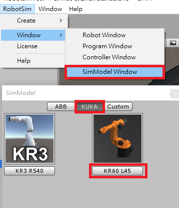
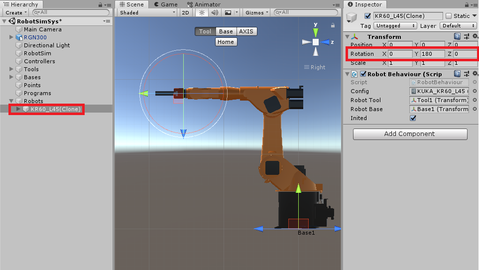
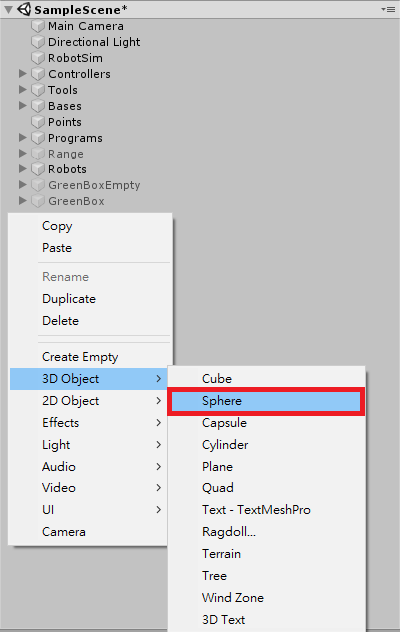

## RobotSim Simulate

- The instructions for the basic operation,  please refer [RobotSim Basic operations](https://yazelin.github.io/usc2019-RobotSim/zh-tw/1RobotSimBasic.html)

---

### Select a robot

- Robotic Type : KUKA KR60-L45-3 [Robotunitypackage](https://github.com/YangPeiYuan/RobotSim_Simulate/raw/master/object/KR60_L45.unitypackage)
	- Payload : 45kg
	- Max. reach: 2230cm
	
- Gripper : RGN+300-1[Gripper Model](https://github.com/YangPeiYuan/RobotSim_Simulate/raw/master/object/RGN300.FBX)

---

### Build working objects

1. Import KUKA KR60-L45-3、Gripper RGN+300-1
	- Import RobotSim custom package                         
                    
		 
		 
	- Add a Robot                                                                              
		

	- Add a gripper                                                                                
		
		
		
		- Find the gripper RNG300 on the menu of SampleScene
		- Drag the gripper RGN300 into the scene and set (Position) as  (X 0, Y 0, Z 0)

		
		- Rotate Robot w.r.t Y-axis(in Unity) at the center of the robot base with 180 degree such that the robot flange will face the gripper exactly.

		
		- Drag obiect RNG300 into Tool1 and set the Flange position at (0, -0.35, 0) such that the center of the flange will match to the center of the gripper RGN300 perfectly.

2. Drawing the working envelope of the robot 
	-To move the robot to observe the reach limitations          

	- Build a 3D spherical object                                                                      
		
		
	- set the scale                                                                         
		
		- set meter as the unit
		- For example: the max reach of the robot is 2.23m, we need to set 4.46m as its diameter. 
         
         
	- set the color                                                                   
		
		- Choose **Materials** and drag to **Element**                                     

	- Likewise, we can build the inner limitation of the robot
		

3. Build the working space

	- Drawing the wall or user's defined station boundary
	- Move the robot to analyze the potential risk of interferences    
    
		
	
		
		- rename **Cube** as **Line** and set its length, height and positions ...
		- duplicate the **Line**above as the second one, and adjust its parameters
		- Note: the position parameter is the center of the object
                                                                                                                  
		
		- the working space after drawing the boundary

4. Buid the other facilitis or objects

	- Depending on the project   
	- [Box](https://github.com/YangPeiYuan/RobotSim_Simulate/raw/master/object/box.FBX)	set Length: 42CM Width: 29CM Height: 15CM 

	 - Put the box on the desired location                                  

		
		 - using the **Position** parameter to choose the right place for the box, unit: meter
                                                                                                                          
		
		- duplicate the box and change **Position** for more other boxes on different places. Note: the height of the box is 15cm
                                                                                                                      
		
		- Uncheck the object on the upper-right will delete the object from the scene, but still remaining the setting of the object. If needed, click check to use the object again  
                                                                                                                            
		
		- After robot motion path analyzing, we layout the robot working space as above

--- 
### Simulation with teaching points

1. Recording teaching points

	- Using [+Point] to add teaching point 

		
		- move robot to the picking position
		- use [+Point] to record the picking point

		
	
		-  duplicate the first picking position and change the height and record as other picking points.

	- Utage of game object
                                                                                       
		
		- Create an empty GameObject
		- 
		                                                                               
		
		- Rename object as BlueBox
		- drag points P1～P1(4) to the empty object
                                                                                        
                                                                                             
		
		- duplicate BlueBox and update  P1～ P1(4) inside for other stacks
                                                                                                   
2. Programming the teaching points

	- use [Programs] for edit
                                                                                                                   
		
		- Arrange the sequence of Add the motion type to each teaching point將點位分別移至所需移動方式，執行時即可讓手臂順利移置點位
                                                                                                          
		
		-  使須夾取物件能夠被夾爪所夾取

		
		- 將手臂Tool拖移至Gripper
		- 下方Lock勾選為夾取物件(True)、反之取消勾選為放下物件(False)
	                                                                                                                             
		
		- 將GripperLock(True)移動至預夾取物件點位下方即可夾取
		- 將GriperLock(False)移動至預放置物件點位下方即可放置

 --- 

### Completed  simulation

<iframe width="560" height="315" src="https://www.youtube.com/embed/m-8mlEnRETc" frameborder="0" allow="accelerometer; autoplay; encrypted-media; gyroscope; picture-in-picture" allowfullscreen></iframe>

<!--stackedit_data:
eyJoaXN0b3J5IjpbMjA4MDcwNzE1OSw5NzcyMTQyNjcsLTg4MD
EzMTM0NiwtMjAwMzA0NjMxMiwtMjU4OTM4MjE5LC0xOTA2MjYx
MDE4LDE4MzUzMTA4MTQsLTEwMzE3ODAxNTYsMTg5MjQ3Nzc1NS
wtNDQ5NDg2OTQ1LC01NTcxMDI3MDcsMjc3MjgwNjEyLDY4NTAx
NTg1OCwyMzIyOTMwOTQsLTEzODg3MDE0OCwtODQwMTkyNTM2LD
EzNzgzMzEwNjNdfQ==
-->