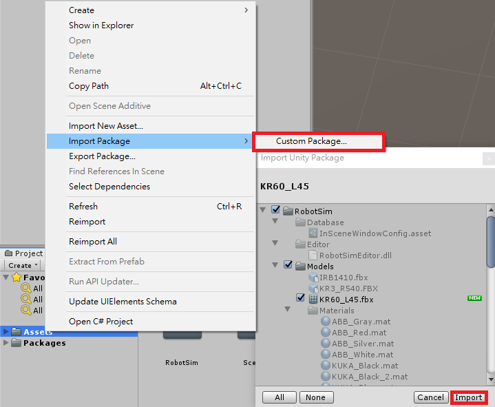
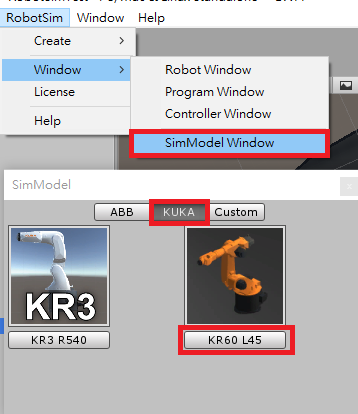
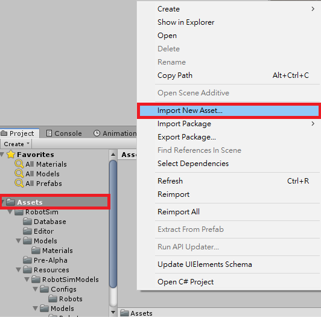
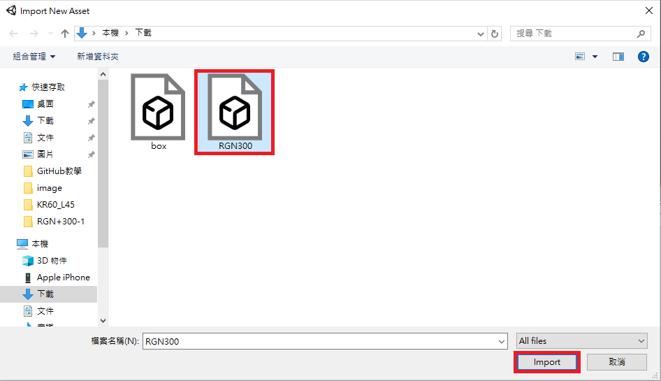
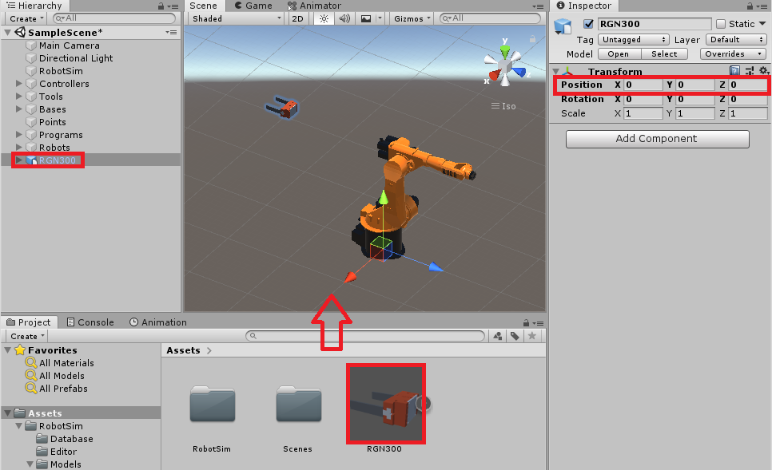
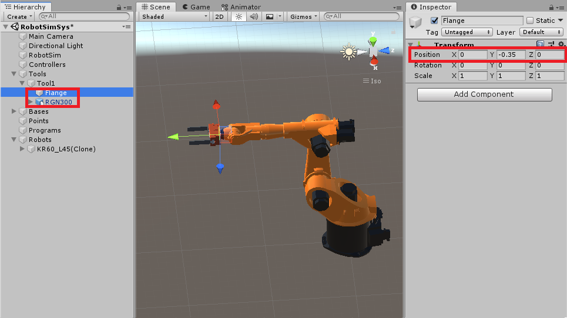
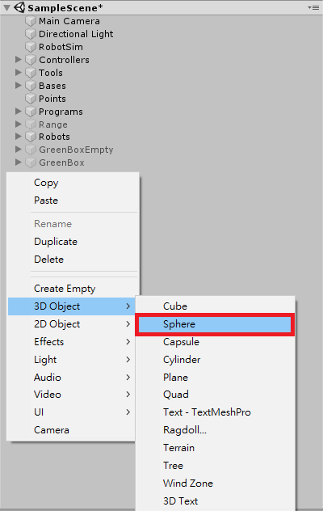
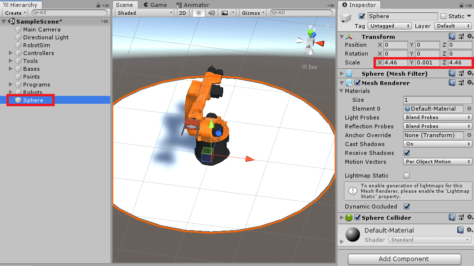
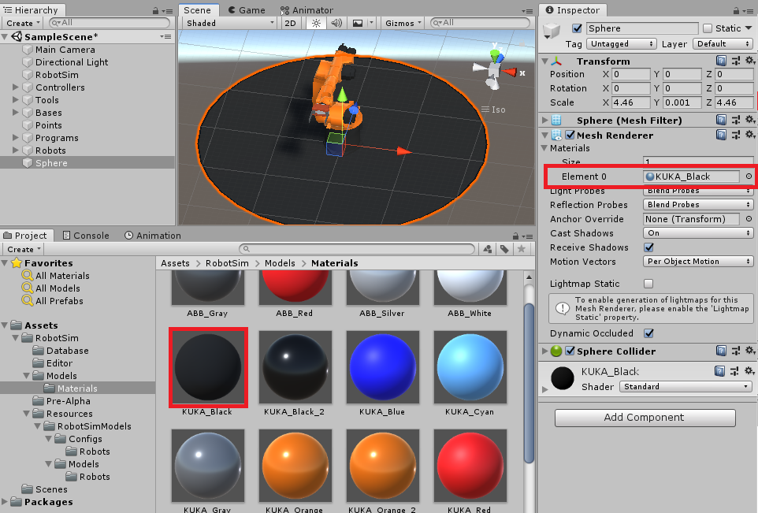
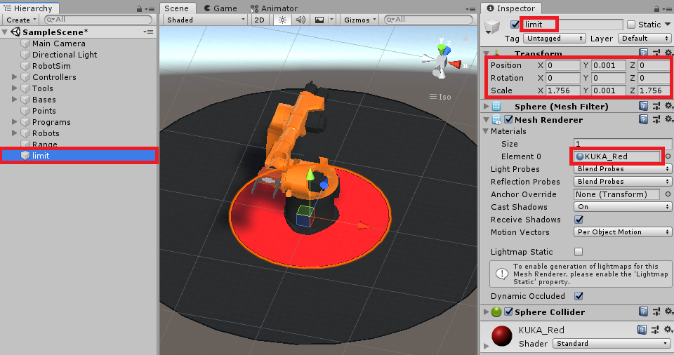

## RobotSim Simulate

- 如操作過程有問題，可參考 [RobotSim基礎](https://yazelin.github.io/usc2019-RobotSim/zh-tw/1RobotSimBasic.html)

---
### 選用設備

- 機械手臂 : KUKA KR60-L45-3
	- 限制重量 : 45kg
	- 工作範圍 : 2230cm
	
- 夾爪 : RGN+300-1

---
### RobotSim建置作業環境

1. 加入機械手臂 KUKA KR60-L45-3、夾爪 RGN+300-1
	- 將手臂模型匯入RobotSim                                              
		 
		 
	- 加入機械手臂                                                                                   
		

	- 加入夾爪模型                                                                                    
		
		
		
		- 將夾爪 RGN300 拖移到場景上，並且把位置設為圓點

		
		- 將手臂轉向180度，法蘭面對準夾爪

		
		- 將 RNG300 物件拉至 Tool1 裡，並且將 Flange、RGN300 位置 Y 各 -0.35 ，這樣即能將手臂Tool改至夾爪前端中心
		
2. 建立手臂作業空間以及極限範圍示意模型

- PS. 移動手臂時較方便目測極限距離

	- 建立球形3D物件                                                                            
		
		
	- 設定物件大小                                                                                 
		
		- 設定範圍單位為 公尺(m)
		- 例 : 手臂作業範圍 2.23m，須設定圓直徑為 4.46m            
         
	- 設定物件顏色                                                                                   
		
		- 選擇 Materials 材質，拖移至 Element 欄位

	- 使用相同方法建立手臂內圈極限範圍
		

4. 建立工作空間範圍
- 手臂在工作空間中手臂ㄍㄨ
5. 建立棧板、空箱、清洗機等物件
6. 加入夾爪並將手臂 Tool 改至夾爪前端中心
<!--stackedit_data:
eyJoaXN0b3J5IjpbMjgxODQwNzYxLC04MDkzMzE4NjEsLTI3Nz
M5MzIyNSwyMDk3MDYxOTYxLDgxMTI5OTI0NCwtMTI1NDQyMTQ3
MSwtNzAxMDUwMjk1LC00NjE4NTY4MTIsLTY5MTY1MDg0NCwyMD
QxMTY1MDgwLDI5NDU0ODY2NCwtMTM0NjkyMDIxNCwyOTQ1NDg2
NjQsMTE4NzY2NjczLC01OTk5NDMwNTQsMTQ3NTAwMTIyLDgxND
cwMjExNCwtMTQwMTgzODAyNCwxNDM4MjQ1NzEzLDE0NzczNzQ5
NjhdfQ==
-->