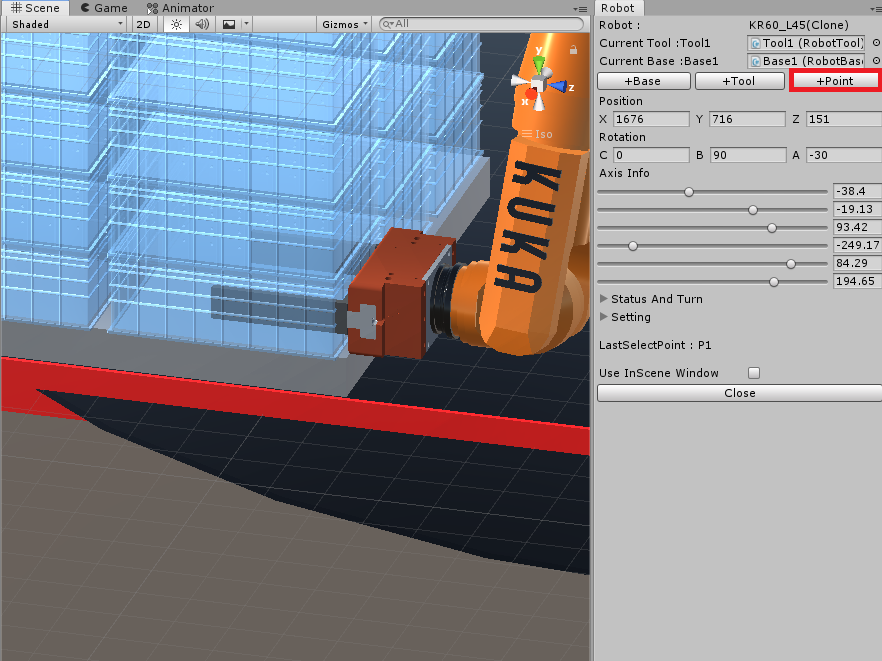
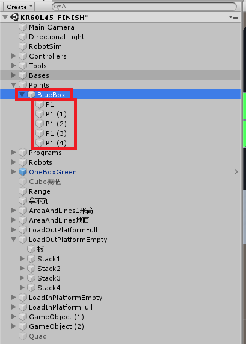

## RobotSim Simulate

- 如操作過程有問題，可參考 [RobotSim基礎](https://yazelin.github.io/usc2019-RobotSim/zh-tw/1RobotSimBasic.html)

---

### 選用設備

- 機械手臂 : KUKA KR60-L45-3[手臂unitypackage](https://github.com/YangPeiYuan/RobotSim_Simulate/raw/master/object/KR60_L45.unitypackage)
	- 限制重量 : 45kg
	- 工作範圍 : 2230cm
	
- 夾爪 : RGN+300-1[夾爪模型](https://github.com/YangPeiYuan/RobotSim_Simulate/raw/master/object/RGN300.FBX)

---

### RobotSim建置作業環境

1. 加入機械手臂KUKA KR60-L45-3、夾爪RGN+300-1
	- 將手臂模型匯入RobotSim                          
                    
		 
		 
	- 加入機械手臂                                                                                   
		

	- 加入夾爪模型                                                                                    
		
		
		
		- 左方SampleScene列表找到RNG300
		- 將夾爪RGN300拖移到場景上，並且把位置 (Position) 設為原點 (X 0, Y 0, Z 0)

		
		- 將手臂旋轉 (Rotation) Y轉向180度，法蘭面對準夾爪

		
		- 將左方列表RNG300物件拉至Tool1裡，並且將Flange、RGN300位置Y各-0.35m，這樣即能將手臂Tool改至夾爪前端中心

2. 建立手臂作業空間以及極限範圍示意模型

	- PS. 移動手臂時較方便目測極限距離                                                                    

	- 建立球形3D物件                                                                            
		
		
	- 設定物件大小規模 (Scale)                                                                                 
		
		- 設定範圍單位為 公尺(m)
		- 例 : 手臂作業範圍2.23m，須設定圓直徑為4.46m            
         
	- 設定物件顏色                                                                                   
		
		- 選擇Materials材質，拖移至Element欄位

	- 使用相同方法建立手臂內圈極限範圍
		

3. 建立工作空間範圍

	- 手臂在空間中可工作的範圍
	- PS. 可用來觀察手臂運動中有無超越或撞機風險        
    
		
	
		
	- 將Cube改名為Line並設定線的長寬高、位置等等...
	- 第二條線只需要複製並調整位置即可
	- PS. 位置參數為物件的中心，如要調整參數須注意

		
	- 設定完成後場景

4. 建立其他專案所需物件

	- 適各專案模擬所需使用其他物件  
	- [箱子模型](https://github.com/YangPeiYuan/RobotSim_Simulate/raw/master/object/box.FBX)	長42CM 寬29CM 高15CM 

	 - 擺放物件方式                                       

		
		 - 利用位置 (Position) 參數放置物體實際位置，單位均為公尺(m)

		
		- 如需要堆疊多個箱子，只需要先設定好第一個箱子位置，其餘則使用複製並更改其位置參數Y，向上移動盒子高度15CM

		
		- 本專案經模擬後，手臂擺放位置更改成Y轉150，此角度下手臂的工作路徑相對較順暢

--- 
### 紀錄各物件點位

- 手臂移動紀錄點位

	
	- 將手臂移動至物件夾取位置
	- 利用 [+Point] 功能紀錄點位

	
	-  記錄完第一點後，其他點只需要使用複製方式，並更改其位置參數(物件box高為15cm，每層點位位置Y相差0.15m
	- 完成第一疊後，其他疊點位只需要複製第一疊，更改其X, Z參數

- 利用空物件進行分類幫助分類不同點位

	
		- 創立一個空的物件GameObject
		
	
		- 將物件名稱更改為所分類名稱
		- 將點位P1至P1 (4)拖移至空物件裡面
<!--stackedit_data:
eyJoaXN0b3J5IjpbLTU0MTcyNTUzMywtMTg3NDAzMjEwMCwtMj
Q1ODk5MDUsLTEwNDU2ODU5NDUsLTcxNzI5NTU0MSwtMTU2NTI0
MjI3NywyMDI0MjkzNDcwLC0xODM5NDk0ODIwLDM0NzA3MzE3MS
wtMTkwNzY1MjA4OSw4NTQyOTg0MSwtMjk0MjM5ODUzLC0xNzEy
MTQ4ODc0LDE0NzA5MDQ5NTMsLTE0MjgyMDAzNDUsLTE2ODAwNT
Y3MzQsLTYxNjEzMTYzNCwtODA5MzMxODYxLC0yNzczOTMyMjUs
MjA5NzA2MTk2MV19
-->