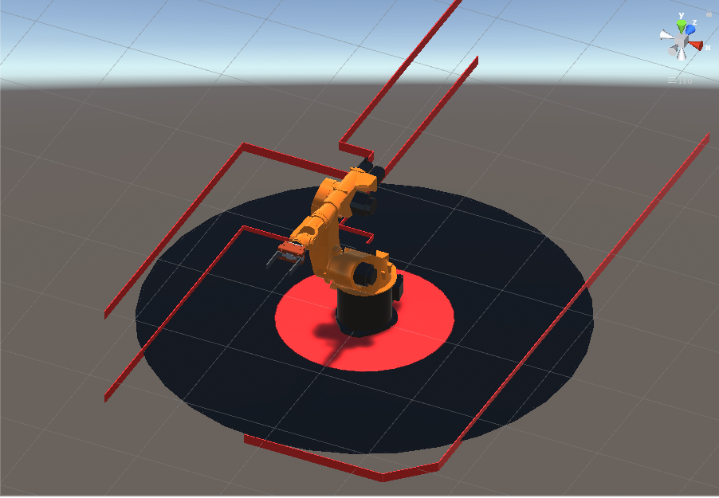

## RobotSim Simulate

- 如操作過程有問題，可參考 [RobotSim基礎](https://yazelin.github.io/usc2019-RobotSim/zh-tw/1RobotSimBasic.html)

---

### 選用設備

- 機械手臂 : KUKA KR60-L45-3[手臂](https://github.com/YangPeiYuan/RobotSim_Simulate/raw/master/object/KR60_L45.unitypackage)
	- 限制重量 : 45kg
	- 工作範圍 : 2230cm
	
- 夾爪 : RGN+300-1[夾爪模型](https://github.com/YangPeiYuan/RobotSim_Simulate/raw/master/object/RGN300.FBX)

---

### RobotSim建置作業環境

1. 加入機械手臂KUKA KR60-L45-3、夾爪RGN+300-1
	- 將手臂模型匯入RobotSim                                              
		 
		 
	- 加入機械手臂                                                                                   
		

	- 加入夾爪模型                                                                                    
		
		
		
		- 將夾爪RGN300拖移到場景上，並且把位置設為原點 (X 0, Y 0, Z 0)

		
		- 將手臂Y轉向180度，法蘭面對準夾爪

		
		- 將RNG300物件拉至Tool1裡，並且將Flange、RGN300位置Y各-0.35m，這樣即能將手臂Tool改至夾爪前端中心

2. 建立手臂作業空間以及極限範圍示意模型

- PS. 移動手臂時較方便目測極限距離                                                                    

	- 建立球形3D物件                                                                            
		
		
	- 設定物件大小                                                                                 
		
		- 設定範圍單位為 公尺(m)
		- 例 : 手臂作業範圍2.23m，須設定圓直徑為4.46m            
         
	- 設定物件顏色                                                                                   
		
		- 選擇Materials材質，拖移至Element欄位

	- 使用相同方法建立手臂內圈極限範圍
		

3. 建立工作空間範圍

- 手臂在空間中可工作的範圍
- PS. 可用來觀察手臂運動中有無超越或撞機風險                               
	
	
	
	- 將Cube改名為Line並設定線的長寬高、位置等等...
	- 第二條線只需要複製並調整位置即可
	- PS. 位置參數為物件的中心，如要調整參數須注意

	
	- 設定完成後場景

4. 建立其他專案所需物件

- 適各專案模擬所需使用其他物件  
- [箱子模型](https://github.com/YangPeiYuan/RobotSim_Simulate/raw/master/object/box.FBX)

	
	- 本專案經模擬後，手臂擺放位置更改成Y轉150，在這個角度下手臂的工作路徑相對較順暢
<!--stackedit_data:
eyJoaXN0b3J5IjpbLTY0OTI1MDMzNCwtMjk0MjM5ODUzLC0xNz
EyMTQ4ODc0LDE0NzA5MDQ5NTMsLTE0MjgyMDAzNDUsLTE2ODAw
NTY3MzQsLTYxNjEzMTYzNCwtODA5MzMxODYxLC0yNzczOTMyMj
UsMjA5NzA2MTk2MSw4MTEyOTkyNDQsLTEyNTQ0MjE0NzEsLTcw
MTA1MDI5NSwtNDYxODU2ODEyLC02OTE2NTA4NDQsMjA0MTE2NT
A4MCwyOTQ1NDg2NjQsLTEzNDY5MjAyMTQsMjk0NTQ4NjY0LDEx
ODc2NjY3M119
-->